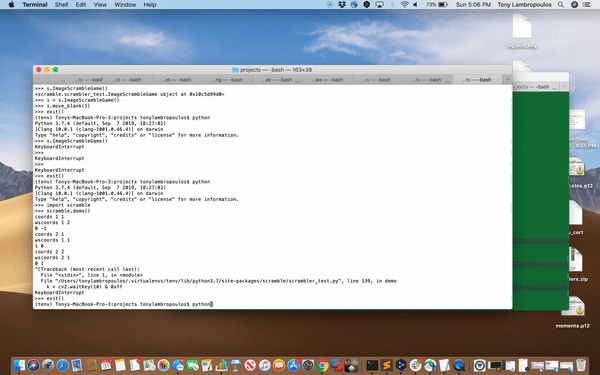
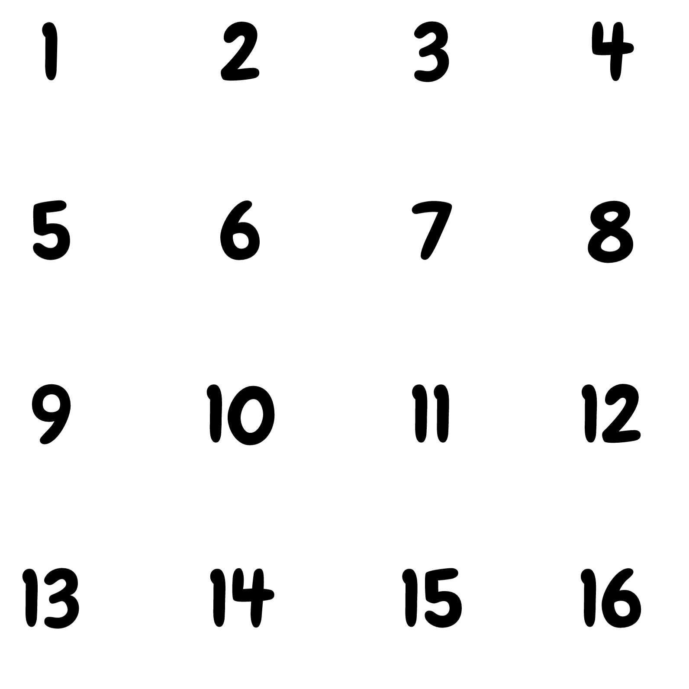

# Scrambler
Inspiration for scrambler here:

http://s.muz.li/ZTg4MTBjYWQ1

Basic idea:

Given a scrambled picture with NxN tiles and removing one "cell" in the grid, reorder the tiles by moving the blank cell around the grid until the image has been unscrambled.

# To install:
create and activate virtual environment
```sh
$ virtualenv -p PYTHON3_PATH venv
$ source venv/bin/activate
```
Install scrambler package
```sh
$ pip install git+https://github.com/tony7126/scramble.git
```
# Demo Instructions
  - Launch python shell (within virtualenv)
```sh
$ python
```
  - import scrambler test module and run demo function
```sh
>>> import scrambler_test
>>> scrambler_test.demo()
```  
  - Click on tiles adjacent to the blank tile to move as in video below.
[](demo/demo.gif)

# Usage Instructions
  - from the scrambler test module import the ImageScrambleGame class and the movement constants
```sh
from scrambler_test import (ImageScrambleGame, 
                            MOVE_UP,
                            MOVE_LEFT,
                            MOVE_DOWN,
                            MOVE_RIGHT)
```

#### Create instance of ImageScrambleGame.  Notes below:
- The class takes three arguments- img_path, gsize, and seednum

        - img_path is the path to the image that will be scrambled.  For the purpose of the test a default image (from demo above) has already been supplied.  This argument can be left out
        
        - gsize is the number of units for the width/height of the grid (gsize=4 makes a 4x4 grid for example)
        
        - seednum is used to seed the random generator to randomize the grid.  Using the same seednum will always result in the same shuffle
Note: Some seednum values will leave to unsolvable scrambles.  In this case an exception is thrown during initialization the scramble class
#### Use the object methods listed below to unshuffle the image
- whitespot_idx()
     - gets index of blank (in 1d array indexing)
- get_part_num(x,y)
   - convenience method to switch to 2d coordinate system
   - Example- on 4x4 grid (indexing is [0-3]x[0-3])
        - get_part_num(3, 3) == 15
        - get_part_num(1, 2) == 9
- get_grid_coord(part_num)
    - convenience method to switch to 1d array indexing 
        - image below shows example ordering but note it starts at 1 while the program starts indexing at 0
    - Examples for 4x4 grid (reverse of above):
        - get_grid_coord(15) == (3, 3)
        - get_grid_coord(9) == (1, 2)
- get_state()
    - Returns gsize x gsize 2d array with current state of tiles 
- move_blank(movement)
    - Movement from constant list in import above

Image is considered unscrambled when all tiles (including the blank, of course) are in their correct place
## Indexing order


# Objective
- Your objective is to use any machine learning algorithm of your choosing to solve this problem for at least the 2x2 grid.
- You must also show that your solution is at least better than random!
- Note: It is completely acceptable to have your solution only solve a certain version of the grid.  For the purpose of this exercise it is not requied to have a general solution.  This is where the "seednum" argument comes in handy- you can reproduce the same board predictably.
- Emailing a zip or any remote git repository (Github, BitBucket, etc...) is acceptable for posting your solution
# Questions?
Just email me
